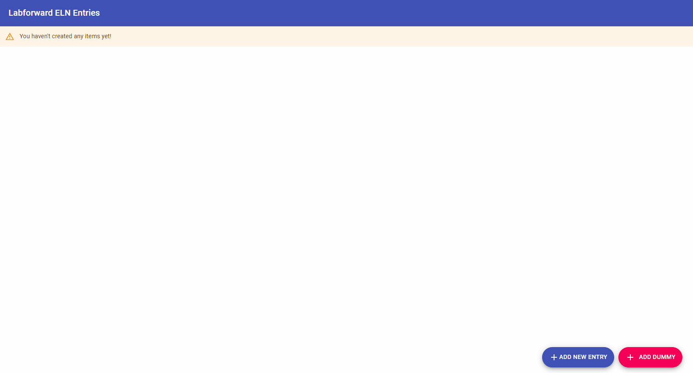

# ELN Crud/Search

ELN Crud/Search is a Spring Boot Java REST API for dealing with Crud and search operations on ELN entries. 

## Usage

In order to run the REST API, please use [Maven](https://maven.apache.org/) wrapper for a quick run. (Runs on ```8080``` port by default).

```bash
./mvnw spring-boot:run
```

To run the UI, you can use the following to run on ```webpack-dev-server```.

```bash
cd eln-ui
npm install
npm run start
```

UI app runs on ```3000``` port by default and expects the API to be running on ```8080```. If not, you can change the base URL in file ```/eln-ui/src/util/Constants.js```.

## Quick Demo



## Definition of Done

* [x] **Implemented the user story about searching entries** by building a REST API with a method taking ```entryId``` and ```word``` in the request and responds with a ```List``` of ```word```, ```distance```, ```frequency```, and ```occurrences``` of the found words. This design choice implied supporting the crud operations on the server side as well. In a REST API like this, sending the ```entry``` content each time to the server (given in *possible* implementation) did not seem like a good practice.
  * **Spent around 20 hours** to complete the task. I am not practiced in Java/Spring and React so I had spent a lot of time around tutorials. I also revised the architecture of packaging of the backend application a few times due to the conventional differences between .NET and Java application architectures.
* [x] **100% test coverage** for ```Service```, ```Controller``` and ```Converter``` methods.
* [x] **Flexible and scalable API architecture** that supports adding other resources and services. I separated the ```TextService``` business logic/domain from ```EntryService``` business logic/domain so that in the future other services may use these bounded services.
* [x] **Simple validations** for entities. In terms of code style, the validations in ```Service``` layer suffer from code smell. They need to be refactored with an AOP approach.
* [x] **Simple validations** for exception handling and returning relevant HTTP Response codes and error messages. Currently, many significant error handlings are missing and error response contents are incompatible with auto configurations of Spring errors.
* [] **What it does not contain:**
  * Despite being in my plans, I did not have time to implement HATEOAS  which makes this REST service deficient.
  * Did not implement any Security related developments such as Authentication, checking HTTP Headers etc.
  * No performance checks and monitoring implemented.
  * No automated build, test, deployment configuration.
  * No authentication, error handling, code refactor, cleanup, render performance optimization etc. for front-end application. It is created only for presentational purpose. I would appreciate if you don't evaluate the code style and architecture in UI code since it's just a quick scribble. Only, text-highlighting part was a good algorithmic challenge for me.

## Built With

### Backend

* 	[JDK 1.8](http://www.oracle.com/technetwork/java/javase/downloads/jdk8-downloads-2133151.html) - 1.8 on purpose since I have learnt that in Labforward, this is the current JDK version that is being used.
* 	[Spring Boot](https://spring.io/projects/spring-boot) - Used for faster bootstrapping.
* 	[Maven](https://maven.apache.org/) - Despite Gradle was in Labforward's tech stack, I thought it may take some time for me to learn its internal details, I decided to use Maven.

###  Libraries and Plugins

* 	[Apache Commons Text](https://mvnrepository.com/artifact/org.apache.commons/commons-text) for text similarity calculation
* 	[ModelMapper](https://mvnrepository.com/artifact/org.modelmapper/modelmapper) for entity-dto mappings
* 	[Springfox Swagger UI](https://mvnrepository.com/artifact/io.springfox/springfox-swagger-ui) for documentation
* 	[React](https://reactjs.org/) for easier UI development
* 	[Material-UI](https://material-ui.com/) for styling. I choosed Material-UI on purpose since it's in the tech stack of Labforward.

## REST API Endpoints

|  URL |  Method | Remarks |
|----------|--------------|--------------|
|`/api/entries`                      | GET     | Gets all entries                              |
|`/api/entries/{id}`                 | GET     | Gets entry by id                              |
|`/api/entries`                      | POST    | Creates new entry                             |
|`/api/entries/{id}`                 | PUT     | Updates an entry                              |
|`/api/entries/{id}`                 | DELETE  | Deletes an entry                              |
|`/api/entries/{id}/search/{word}`   | GET     | Searches a word and similar words in an entry |

## Documentation

* 	[SwaggerUI](http://localhost:8080/swagger-ui/) - http://localhost:8080/swagger-ui/ - Documentation & Testing

## License
[GPLv3](https://www.gnu.org/licenses/gpl-3.0.en.html)
